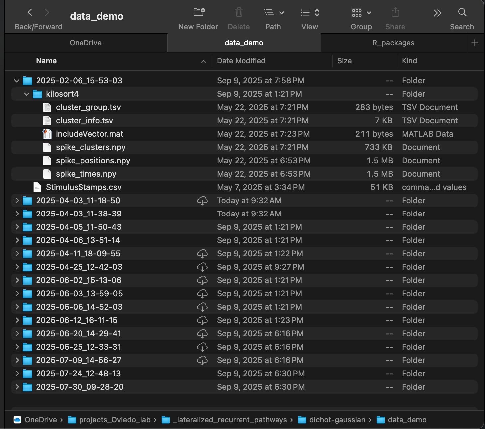

```{r Rmdsetup, echo=FALSE}
# Set max width of markdown code outputs
options(width = 10000)
```

This tutorial shows how to use the neurons package to run a dichotomized Gaussian (DG) analysis of autocorrelation on KiloSort4 data. The aim of this DG analysis of autocorrelation is to estimate the network time constant of single neurons in the left and right hemisphere of various genotypes of mice. Network time constants provide an estimate of recurrence. Specifically, a higher network time constant indicates that a neuron receives a larger number of projections back on itself. Intuitively, the longer into the future a spike *now* increases the probability of a spike *later*, the stronger the connections from that neuron back onto itself must be. 

<h1>Setup</h1>

The first step is to set up the R environment by clearing the workspace, setting a random-number generator seed, and loading the neurons package.

```{r Rsetup}
# Clear the R workspace to start fresh
rm(list = ls())

# Set seed for reproducibility
set.seed(12345) 

# Load neurons package
library(neurons) 
```

<h1>Load data</h1>

This tutorial uses data recorded by multi-channel probes from the auditory cortex of mice with spike clusters extracted with kilosort4, plus a csv file with stimulus event information. A path to the data must be provided. 

```{r datapath}
# Set path to data 
demo_data <- "/Users/michaelbarkasi/Library/CloudStorage/OneDrive-WashingtonUniversityinSt.Louis/projects_Oviedo_lab/_lateralized_recurrent_pathways/dichot-gaussian/data_demo"
```

The function **preprocess.kilo4** will be used to process the data. This function expects **data_path** to point to a folder the subfolders of which each contain a single kilosort4 output. This output should be in its own folder **kilosort4**. While kilosort outputs many files, only six are needed: 

- **spike_positions.npy**: 2D array giving the x and y position of each spike  
- **spike_clusters.npy**: integer giving the cluster number of each spike  
- **spike_times.npy**: sample number the spike occurred at  
- **cluster_group.tsv**: 2D array giving status of each cluster (0=noise, 1=MUA, 2=Good, 3=unsorted), hand-curated  
- **cluster_info.tsv**: 2D array giving the automatic output of kilosort4; not needed if cluster_group.tsv has data.
- **includeVector.mat**: MATLAB file giving whether each cluster is stimulus-responsive (1) or not (0)  

More of the kilosort4 output files can be included, but only the above files (minus **cluster_info.tsv**) are required. In addition, along with the kilosort4 subfolder, there should be a file **StimulusStamps.csv** in each recording folder. 

<div class="figure">
  preprocess.kilo4</b> function." width="90%">
  <p class="caption">Folder structure necessary for <b>preprocess.kilo4</b> function.</p>
</div>

Meta data must also be pulled from the recordings. For this tutorial, the csv file with that data in the neurons package itself. It can be loaded with the regular **read.csv** function in R. 

```{r load_metadata} 
kilo4_metadata <- read.csv(
  system.file(
    "extdata", 
    "meta_data_kilo4demo.csv", 
    package = "neurons"
    )
  )
```

For the purpose of statistical analysis, covariates of interest are all that's needed from the meta data file. The neurons package (as of v1.0) can only handle certain covariates, and expects them to have specific names. It will also expect the data frame holding those covariates to have rows labeled with recording names that match the format of the recording names in the data. 

```{r reformat_metadata}
# Format and apply recording names to metadata as row names
rownames(kilo4_metadata) <- paste0(
  kilo4_metadata$DAY, 
  "_",
  kilo4_metadata$Neuralynx_ID
  )

# Keep only the relevant columns (covariates of interest)
kilo4_metadata <- kilo4_metadata[,c("HEMISPHERE","STRAIN","AGE","SEX")]

# Rename columns to match what's expected by neurons package 
colnames(kilo4_metadata) <- c("hemi", "genotype", "age", "sex")
```

<h1>Preprocess data into spike rasters</h1>

The function **preprocess.kilo4** converts raw cluster spike times into spike rasters of a standardized format expected by the neurons package. The recordings must be partitioned into trials, which **preprocess.kilo4** does with start and stop times relative to a stimulus. For example, information about responses to stimuli can be analyzed by setting the start time to something negative (before the stimulus) and the end time to something positive (after the stimulus). However, for estimating autocorrelation, it's the spontaneous activity during a period of silence after the stimulus which must be analyzed. In this case, the start time should be some time after the stimulus (to allow for settling) and the end time some time later. 

```{r preprocess_kilosort4_data}
# old recordings used 1520 ms of silence, once settled
# ... settling seems to take 500 ms
spike.rasters.kilo4 <- preprocess.kilo4(
  trial_time_start = 500,      # ms
  trial_time_end = 500 + 1520, # ms
  recording.folder = demo_data,
  meta_data = kilo4_metadata, 
  pure_trials_only = TRUE, 
  good_cells_only = TRUE,
  stim_responsive_only = FALSE,
  verbose = FALSE
) 
```

A path (such as **demo_data**) for the actual data must be passed to **preprocess.kilo4**. Meta data (such as **kilo4_metadata**) can also be provided, but is not necessary. If left out, the preprocessed output will simply lack information about covariates. 

In addition to the start and stop times and pointers to the data, **preprocess.kilo4** has four Boolean variables, **pure_trials_only**, **good_cells_only**, **stim_responsive_only**, and **verbose**. The first, **pure_trials_only**, controls whether trials which overlap with another (i.e., have a start time before the end time of the previous trial) are included in the data. The second, **good_cells_only**, controls whether spike clusters are included without passing hand curation. Likewise, the third, **stim_responsive_only** controls whether spike clusters are included without being responsive to stimului. Finally, if **verbose** is set to TRUE, the function will print out information about the files it is finding and parsing. 

The output **spike.rasters.kilo4** is a list with three elements: **spikes**, **timeXtrial**, and **cluster.key**. The first element, **spikes**, is a data frame giving a sparse representation of the spike rasters from each recording. Each row is a spike, with columns giving information such as cell number, time, and genotype. Here are the first few rows of the **spikes** data frame:

```{r}
print(head(spike.rasters.kilo4$spikes))
```

The second element, **timeXtrial**, is a list of matrices, one per cell, with rows corresponding to time bins and columns to trials. Each entry is a binary indicator of whether the cell fired in that time bin during that trial. The third element, **cluster.key**, is a data frame with rows representing cells, columns giving information such as cell number, genotype, and number of spikes. 

```{r}
print(spike.rasters.kilo4$cluster.key)
```

With the kilosort4 data preprocessed into spike rasters, the next step is to convert them into a special class of object from the neuron package, **neuron**. 

```{r create_neuron_objects}
neurons.kilo4 <- load.rasters.as.neurons(spike.rasters.kilo4$spikes, sample_rt = 1e3)
```

We want to load the spike rasters as **neuron**s because **neurons**s come with built-in methods for estimating autocorrelation parameters with dichotomized Gaussian simulations. 

```{r estimate_autocorr}
# ... set number of sims to run per neuron
n_sims <- 1000
# ... set number of trials to simulate per neuron
n_trials <- 500
# ... run estimates on data
autocor.ests.kilo4 <- estimate.autocorr.params(
  neuron_list = neurons.kilo4,
  n_trials_per_sim = n_trials, 
  n_sims_per_neurons = n_sims, 
  bin_count_action = "sum",
  A0 = 0.001,
  tau0 = 1.0,
  ctol = 1e-8,
  max_evals = 500,
  verbose = FALSE
  )

```

Run analysis: 

```{r stat_analysis}
autocorr_results <- analyze.autocorr(
  autocor.ests.kilo4,
  covariate = c("hemi","genotype"),
  n_bs = 1e4,
  bins_per_sec = 50
)

df <- data.frame(
  value = unlist(autocorr_results, use.names = FALSE),
  group = rep(names(autocorr_results), each = nrow(autocorr_results))
)

# Plot
title_size <- 20 
axis_size <- 12 
legend_size <- 10
ggplot2::ggplot(df, ggplot2::aes(x = value, fill = group)) +
  ggplot2::geom_density(alpha = 0.6) +
  #scale_y_continuous(transform = "log1p") +
  ggplot2::labs(title = "Expected Time Constant", x = "ms", y = "Density") +
  ggplot2::theme_minimal() + 
  ggplot2::theme(
    plot.title = ggplot2::element_text(hjust = 0.5, size = title_size),
    axis.title = ggplot2::element_text(size = axis_size),
    axis.text = ggplot2::element_text(size = axis_size),
    legend.title = ggplot2::element_text(size = legend_size),
    legend.text = ggplot2::element_text(size = legend_size),
    legend.position = "bottom"
  )
```