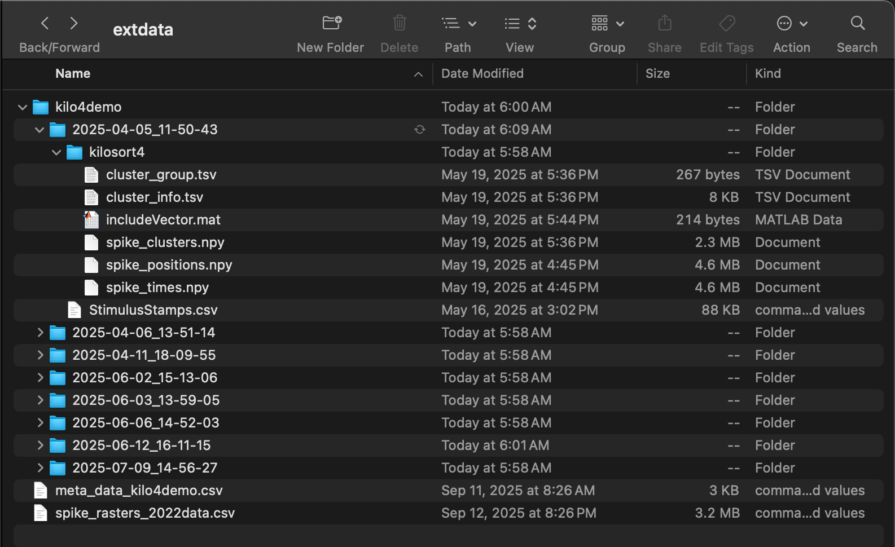

```{r Rmdsetup, echo=FALSE}
# Set max width of markdown code outputs
options(width = 10000)
```

The neurons package provides functions to use [dichotomized Gaussians to estimate network time constants](tutorial_tau_est_DG.html) on different kinds of spike data ([Macke et al. 2009](https://doi.org/10.1162/neco.2008.02-08-713), [Neophytou et al. 2022](https://doi.org/10.1371/journal.pbio.3001803)), including kilosort4 output. [KiloSort4](https://doi.org/10.1038/s41592-024-02232-7) is a [Python package](https://github.com/MouseLand/Kilosort) for extracting spike clusters (a proxy for individual neurons) from multi-channel probe recordings. Network time constants provide an estimate of recurrence by quantifying decay in spiking autocorrelation as a function of lag time. A higher network time constant indicates that a neuron receives a larger number of projections back on itself. Intuitively, the longer into the future a spike *now* increases the probability of a spike *later*, the stronger the connections from that neuron back onto itself must be. 

<h2>Load data</h2>

Begin by clearing the R workspace, setting a random-number generator seed, and loading the neurons package.

```{r Rsetup}
# Clear the R workspace to start fresh
rm(list = ls())

# Set seed for reproducibility
set.seed(12345) 

# Load neurons package
library(neurons) 
```

<h3>Spike and stimulus data</h3>

Provide the file path to the output from kilosort4. Recordings from the left and right hemisphere of various genotypes of mice are used for this tutortial. These recordings targeted the auditory cortex and were made while auditory stimuli were played at regular intervals. 

```{r datapath}
# Set path to data 
demo_data <- system.file(
    "extdata", 
    "kilo4demo", 
    package = "neurons"
  )
```

The function used to process kilosort4 output is [preprocess.kilo4](../reference/preprocess.kilo4.html). This function expects its argument **data_path** to point to a folder the subfolders of which each contain a single kilosort4 output. This output should be in its own folder **/kilosort4**. The following four files are needed:

- **spike_positions.npy**: 2D array giving the x and y position of each spike  
- **spike_clusters.npy**: integer giving the cluster number of each spike  
- **spike_times.npy**: sample number at which the spike occurred 
- **cluster_group.tsv** or **cluster_KSLabel.tsv** or **cluster_info.tsv**: 2D array giving status of each cluster (0=noise, 1=MUA, 2=Good, 3=unsorted)

In addition, a MATLAB file **includeVector.mat** specifying whether each cluster is stimulus-responisve (1) or not (0) should be included in the kilosort4 folder. Finally, along with the kilosort4 subfolder, there should be a file **StimulusStamps.csv** in each recording folder. 

<div class="figure">
  
  <p class="caption">Folder structure necessary for [preprocess.kilo4](../reference/preprocess.kilo4.html) function.</p>
</div>

<h3>Covariate data</h3>

Metadata about the recordings (formatted as a dataframe) is needed to supply covariates.  

```{r load_metadata} 
# Load 
kilo4_metadata <- read.csv(
    system.file(
      "extdata", 
      "meta_data_kilo4demo.csv", 
      package = "neurons"
    )
  )

# Preview
print(head(kilo4_metadata))
```

The neurons package (as of v1.0) can only handle certain covariates, and expects them to have specific names (**type**, **genotype**, **sex**, **hemi**, **region**, **age**). The package also expects the dataframe holding those covariates to have rows labeled with recording names that match the format of the recording names in the data. 

```{r reformat_metadata}
# Format and apply recording names to metadata as row names
rownames(kilo4_metadata) <- paste0(
    kilo4_metadata$DAY, 
    "_",
    kilo4_metadata$Neuralynx_ID
  )

# Keep only the relevant columns (covariates of interest)
kilo4_metadata <- kilo4_metadata[,c("HEMISPHERE","STRAIN","AGE","SEX")]

# Rename columns to match what's expected by neurons package 
colnames(kilo4_metadata) <- c("hemi", "genotype", "age", "sex")

# Preview 
print(head(kilo4_metadata))
```

<h2>Preprocess data into spike rasters</h2>

The function [preprocess.kilo4](../reference/preprocess.kilo4.html) converts cluster spike times into spike rasters of the standardized format expected by the neurons package. 

<h3>Parsing trials and quality control</h3>

The output of kilosort4 must be partitioned into trials, which [preprocess.kilo4](../reference/preprocess.kilo4.html) does with start and stop times relative to a stimulus specified in **StimulusStamps.csv**. For example, information about responses to stimuli can be analyzed by setting the start time to something negative (before the stimulus) and the end time to something positive (after the stimulus). However, for estimating autocorrelation, it's the spontaneous activity during a period of silence after the stimulus which should be analyzed. In this case, the start time should be some time after the stimulus (to allow for settling) and the end time some time later. 

```{r preprocess_kilosort4_data}
spike.rasters <- preprocess.kilo4(
    trial_time_start = 500,      # ms
    trial_time_end = 500 + 1520, # ms
    recording.folder = demo_data,
    meta_data = kilo4_metadata, 
    max_spikes = 1e4,
    min_spikes = 1e2,
    min_trials = 1e2,
    pure_trials_only = TRUE, 
    good_cells_only = TRUE,
    stim_responsive_only = TRUE,
    verbose = FALSE
  ) 
```

A path (such as **demo_data**) for the actual data must be passed to [preprocess.kilo4](../reference/preprocess.kilo4.html). Metadata (such as **kilo4_metadata**) will usually be provided, but is not necessary for the function to run. If left out, the preprocessed output will simply lack information about covariates. 

In addition to the start and stop times and pointers to the data, [preprocess.kilo4](../reference/preprocess.kilo4.html) has three Boolean variables controlling the quality of clusters extracted for further analysis:

- **pure_trials_only**: include only trials which do not overlap with other trials (i.e., do not have a start time before the end time of any previous trials)?
- **good_cells_only**: include only spike clusters which passed hand curation?
- **stim_responsive_only**: include only spike clusters which are responsive to stimuli?

Three additional numeric variables are also useful for quality control: 

- **max_spikes**: maximum number of spikes a cluster can have to be extracted
- **min_spikes**: minimum number of spikes a cluster must have to be extracted
- **min_trials**: minimum number of trials a cluster must have to be extracted

Finally, if **verbose** is set to TRUE, the function will print out information about the files it is finding and parsing. 

<h3>Raster format</h3>

The output of [preprocess.kilo4](../reference/preprocess.kilo4.html), in this case **spike.rasters**, is a list with three elements: **spikes**, **timeXtrial**, and **cluster.key**. The first element, **spikes**, is a single dataframe giving a compact spike-indexed representation of the spike rasters (plus covariates) from all recordings. Each row is a spike, with columns giving information such as cell number, time, and genotype. 

```{r}
print(head(spike.rasters$spikes))
```

The second element, **timeXtrial**, is a list of matrices, one per cell, with rows corresponding to time bins and columns to trials. Each entry is a binary indicator of whether the cell fired in that time bin during that trial. Thus, **timeXtrial** contains the rasters of **spikes** in a verbose time-indexed format. 

The third element, **cluster.key**, is a dataframe with rows representing clusters (i.e., "cells") and columns giving information such as cell number, genotype, and number of spikes. 

```{r}
print(head(spike.rasters$cluster.key))
```

<h3>Cluster summary</h3>

Important summary information can be pulled from **cluster.key**. For example, how many cells were included in the output?

```{r summary_info}
n_cells <- nrow(spike.rasters$cluster.key)
cat("Number of cells included:", n_cells)
```

The number of cells and summary statistics, such as mean spike and trial count, can be pulled for each covariate combination as well. While this can be done with minimal code by hand, the function [summarize.cluster.key](../reference/summarize.cluster.key.html) automates this process.

```{r summary_info_advanced}
# Print results 
covariate_summary <- summarize.cluster.key(
    key = spike.rasters$cluster.key, 
    covariate_list = c("genotype", "hemi", "sex")
  )
print(covariate_summary)
```

Thus, for Mecp2 HET mice, 26 clusters from the right hemisphere of females passed the quality control, with none from males or the left hemisphere. For Shank3 KO mice, 9 clusters passed from the left hemisphere of males and 1 from the left hemisphere of females, with none from the right hemisphere. For C57 (wildtype) mice, 1 cluster passed from the left hemisphere of females, with none from males or the right hemisphere. 

<h2>Converting to neurons</h2>

With the kilosort4 data preprocessed into spike rasters, the next step is to use the function [load.rasters.as.neurons](../reference/load.rasters.as.neurons.html) to convert these rasters into a special class of object from the neuron package, **neuron**. This function will convert all clusters appearing in the raster into individual **neuron** objects and return them in a list.

```{r create_neuron_objects}
neurons <- load.rasters.as.neurons(
    spike.rasters$spikes, 
    sample_rt = 1e3
  )
```

Class **neuron** comes with built-in methods for plotting rasters, plotting autocorrelation, and estimating autocorrelation parameters with dichotomized Gaussian simulations. These methods can be accessed directly via the Rcpp objects, or through wrappers provided by the neurons package.

<h3>Visualizing autocorrelation</h3>

For example, here is the raster from one cell, plotted with the [plot.raster](../reference/plot.raster.html) wrapper: 

```{r plot_raster_high_autocor}
cell_high <- 25
plot.raster(neurons[[cell_high]]) 
```

This cell exhibits high autocorrelation, as can be seen by the long horizontal streaks of spikes. Contrast this raster with one from a cell with low autocorrelation:

```{r plot_raster_low_autocor}
cell_low <- 13
plot.raster(neurons[[cell_low]]) 
```

Notice how the raster for this cell shows more randomly scattered spikes, with fewer (almost no) long streaks. The streaks absent here, but present in the previous raster, are a manifestation of autocorrelation, i.e., the tendency of a spike now to increase the probability of a spike later.

<h3>Empirical autocorrelation and exponential decay fits</h3>

Beyond visualizing it as streaks in a raster, autocorrelation can be quantified both by using the raster data to compute the empirical correlation between spikes separated by different lag times (empirical autocorrelation), and by fitting an exponential decay model to those empirically estimated spike correlations. The empirical autocorrelation can be computed with centering-and-normalization, or without (i.e., "raw autocorrelation"). The [tutorial on estimating network time constants](tutorial_tau_est_DG.html) provides a comparison between empirical vs population autocorrelation, and centered-and-normalized vs raw autocorrelation. The class **neuron** provides a method for computing both versions of empirical autocorrelation, and the neurons package provides a wrapper [compute.autocorr](../reference/compute.autocorr.html) with default parameters to access it. Similarly, there is a method and corresponding wrapper [fit.edf.autocorr](../reference/fit.edf.autocorr.html) for fitting a decay model to the empirical estimate. Here, for example, these wrappers applied to the above cells:

```{r quantify_autocor}
# High autocorrelation cell
compute.autocorr(neurons[[cell_high]])
fit.edf.autocorr(neurons[[cell_high]])

# Low autocorrelation cell
compute.autocorr(neurons[[cell_low]])
fit.edf.autocorr(neurons[[cell_low]])
```

The results can be visualized by using the [plot.autocorrelation](../reference/plot.autocorrelation.html) function to plot both the computed empirical autocorrelation and fitted exponential decay in empirical autocorrelation. Here is the high-autocorrelation cell:

```{r plot_autocor_high}
plot.autocorrelation(neurons[[cell_high]])
```

Here is the plot for the low-autocorrelation cell:

```{r plot_autocor_low}
plot.autocorrelation(neurons[[cell_low]]) 
```

The parameters of the exponential decay fit can be fetched directly with a neuron method and provide succinct quantification of the empirical autocorrelation. 

```{r}
# Fetch and print exponential decay parameters
print(neurons[[cell_high]]$fetch_EDF_parameters())

# Fetch and print exponential decay parameters
print(neurons[[cell_low]]$fetch_EDF_parameters())
```

The amplitude, $A$, gives the autocorrelation at lag time 1 (minus the bias), while the time constant, $\tau$ (tau), gives the rate of decay in autocorrelation as lag time increases. Notice how the high-autocorrelation cell has a time constant of 131ms and an amplitude of 0.07, while the low-autocorrelation cell has a time constant of only 20ms and an amplitude of 0.006. 

In practice, the individual steps shown above do not need to be run with separate method calls. The neurons package provides a function, [process.autocorr](../reference/process.autocorr.html), which does all of these steps in one call for a list of neurons.

```{r process_autocorr_as_batch}
autocor.results.batch <- process.autocorr(neurons)
print(head(autocor.results.batch))
```

<h2>Estimating population autocorrelation</h2>

Recall that the aim is to estimate the network time constant for covariates of interest, e.g., $\tau$ in the right vs left hemisphere of C57 (wildtype) mice, or $\tau$ in the right hemisphere of C57 vs Shank3 KO mice. That is, the aim is not only to compute the empirical autocorrelation of a finite sample, but to estimate population values. At first glance, the output of [process.autocorr](../reference/process.autocorr.html) appears to provide all that's needed for this estimation. Why not simply take the covariate means of the $\tau$ values listed in the output of [process.autocorr](../reference/process.autocorr.html)? 

<h3>The problem</h3>

The problem is that recurrence is very noisy, the amount of data available from which to extract a signal through all that noise is low, and $\tau$ itself is an imperfect measure of the network time constant. To see the problem, consider the lone cluster from a C57 mouse in the demo data. Obviously a single data point is not enough to estimate the population value of a variable, but even this single data point is an unreliable estimate of the true network time constant of this one individual cell. Consider what happens when a slightly different initial condition is used in the fit of the exponential decay model. First, set the initial amplitude to 0.001 (the default value in neurons): 

```{r fit_variability1}
# Set cell number
C57_cell_num <- 37
fit.edf.autocorr(neurons[[C57_cell_num]], A0 = 0.001)
C57_plot <- plot.autocorrelation(neurons[[C57_cell_num]], return_plot = TRUE)
print(neurons[[C57_cell_num]]$fetch_EDF_parameters())
```

With this initial condition, $\tau$ is 378 ms. Now, set the initial amplitude to 0.01:

```{r fit_variability2}
fit.edf.autocorr(neurons[[C57_cell_num]], A0 = 0.01)
print(neurons[[C57_cell_num]]$fetch_EDF_parameters())
```

With this initial condition, $\tau$ is now 2 ms. 

What's happening? Consider the autocorrelation plot resulting from the first fit with a low initial amplitude and high $\tau$: 

```{r fit_variability2_plot}
print(C57_plot)
```

Notice the blue line, which gives the computed empirical autocorrelation as a function of lag. The exponential component of the blue line is clearly small, with its initial peak amplitude $A$ only slightly larger than its baseline bias. Given the exponential decay model (the red line):

 \[y = A * \exp(-\text{lag}/\tau) + \text{bias}\] 

this behavior can be accommodated in two ways: either neuron 37 has a low baseline autocorrelation that decays slowly (low $A$, high $\tau$), or it has a high baseline autocorrelation that decays quickly (high $A$, low $\tau$). These are the two solutions the optimization algorithm finds, depending on the initial conditions. The upshot is that the data is simply too noisy to decide between them. More generally, unless *both* autocorrelation and the network time constant are relatively high (e.g., as with neuron 25 with $\tau=131$ and $A=0.07$), noise will quickly dominate and the estimated $\tau$ will depend on initial conditions.

<h3>Dichotomized Gaussians</h3>

Thus, exponential decay fits to computed empirical autocorrelation are often not reliable estimates of the network time constant, even for individual neurons. Any statistical method for estimating the population network time constant for a covariate of interest based on these unreliable individual estimates (e.g., bootstrapping) will only amplify the noise. The solution is to estimate the network time constant from simulations, not the observed data itself. Specifically, [dichotomized Gaussians](tutorial_tau_est_DG.html) can be used to generate simulated spike trains consistent with the observed data. The exponential decay model can be fit to each simulation, yielding a distribution of possible $\tau$ values for each neuron. For the purpose of speed, this tutorial runs only 100 simulations per neuron, but in practice, 1000 or more simulations should be run. 

```{r estimate_autocorr}
autocor.ests <- estimate.autocorr.params(
    neuron_list = neurons,
    n_trials_per_sim = 500, 
    n_sims_per_neurons = 100, 
    bin_count_action = "sum",
    A0 = 0.001,
    tau0 = 1.0,
    ctol = 1e-8,
    max_evals = 500,
    verbose = FALSE
  )
```

With the simulations run, the final step is to estimate the network time constant for covariates of interest. The function [analyze.autocorr](../reference/analyze.autocorr.html) does this by bootstrapping over the tau values obtained from the simulations. If there are $n$ neurons in a covariate level, $m$ simulations have been run per neuron, then each bootstrap resample consists of the mean of $n$ draws with replacement from the pool of $nm$ values for $\tau$. For this tutorial, 10k bootstrap resamples are used.

```{r stat_analysis}
# Run analysis
autocorr_results <- analyze.autocorr(
  autocor.ests,
  covariate = c("hemi","genotype"),
  n_bs = 1e4
)
```

The function [analyze.autocorr](../reference/analyze.autocorr.html) returns a list with two objects. The first is **resamples**, a dataframe holding the tau values for each covariate from each simulation. 

```{r resamples}
print(head(autocorr_results$resamples))
```

The second is **distribution_plot**, a ggplot2 object visualizing the bootstrap distributions of tau for each covariate.

```{r plot_distribution}
print(autocorr_results$distribution_plot)
``` 

<h2>Code summary</h2> 

The essential steps to run this analysis are as follows: 

```{r code_summary, eval=FALSE}
# Setup
rm(list = ls())
set.seed(12345) 
library(neurons) 

# Load and format metadata
kilo4_metadata <- read.csv(
  system.file(
    "extdata", 
    "meta_data_kilo4demo.csv", 
    package = "neurons"
    )
  )
rownames(kilo4_metadata) <- paste0(
  kilo4_metadata$DAY, 
  "_",
  kilo4_metadata$Neuralynx_ID
  )
kilo4_metadata <- kilo4_metadata[,c("HEMISPHERE","STRAIN","AGE","SEX")]
colnames(kilo4_metadata) <- c("hemi", "genotype", "age", "sex")

# Load data spike and stimulus data
spike.rasters <- preprocess.kilo4(
  trial_time_start = 500,      # ms
  trial_time_end = 500 + 1520, # ms
  recording.folder = system.file(
    "extdata", 
    "kilo4demo", 
    package = "neurons"
    ),
  meta_data = kilo4_metadata, 
  max_spikes = 1e4,
  min_spikes = 1e2,
  min_trials = 1e2,
  pure_trials_only = TRUE, 
  good_cells_only = TRUE,
  stim_responsive_only = TRUE,
  verbose = FALSE
) 

# Make neurons
neurons <- load.rasters.as.neurons(
  spike.rasters$spikes, 
  sample_rt = 1e3
  )

# Run simulations
autocor.ests <- estimate.autocorr.params(
  neuron_list = neurons,
  n_trials_per_sim = 500, 
  n_sims_per_neurons = 100, 
  bin_count_action = "sum",
  A0 = 0.001,
  tau0 = 1.0,
  ctol = 1e-8,
  max_evals = 500,
  verbose = FALSE
  )

# Run analysis
autocorr_results <- analyze.autocorr(
  autocor.ests,
  covariate = c("hemi","genotype"),
  n_bs = 1e4
)
```